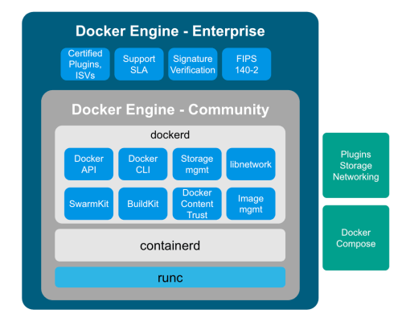
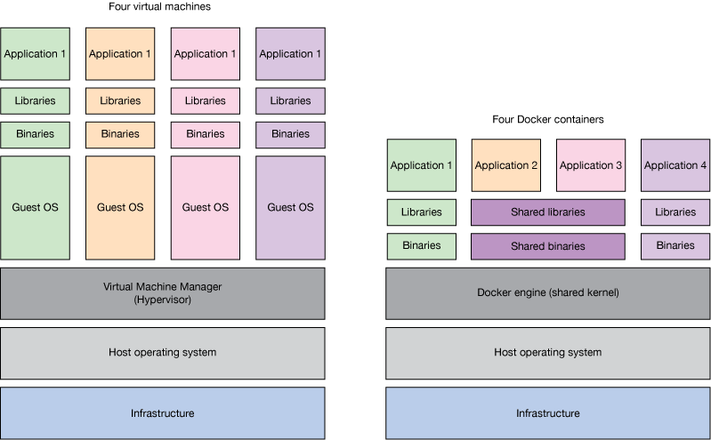
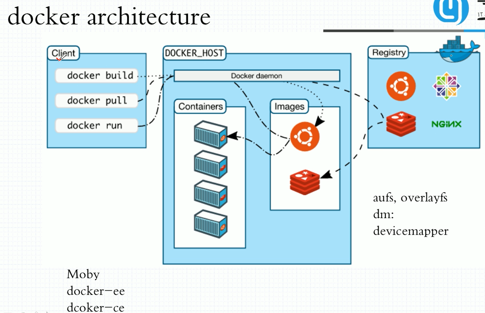
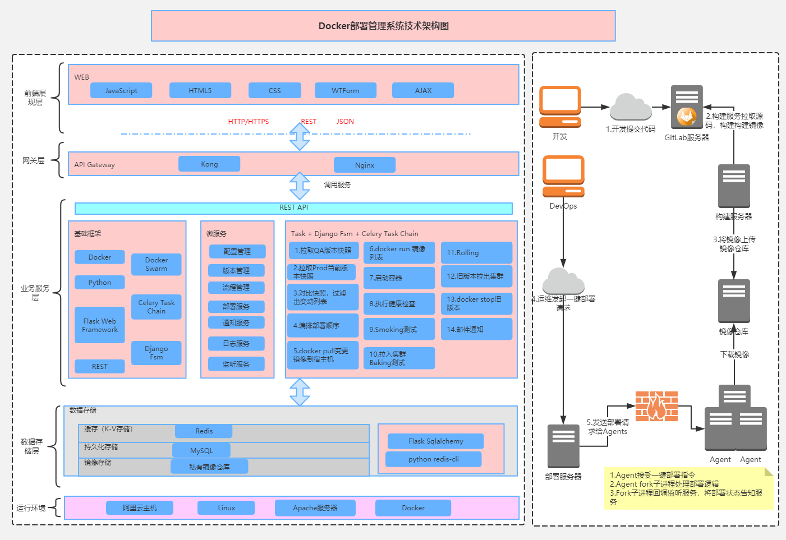
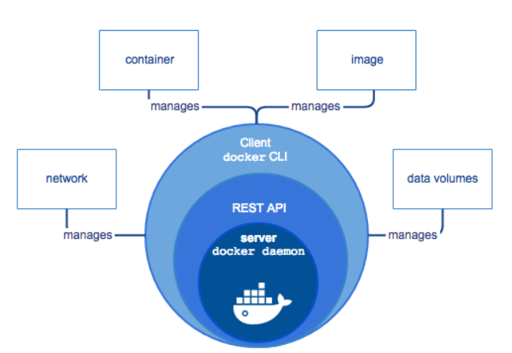
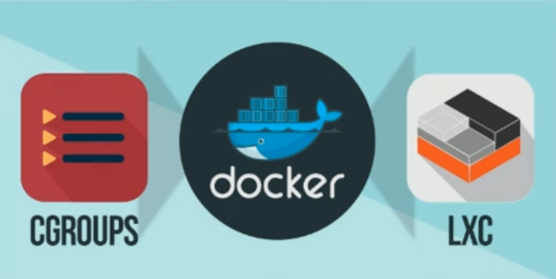
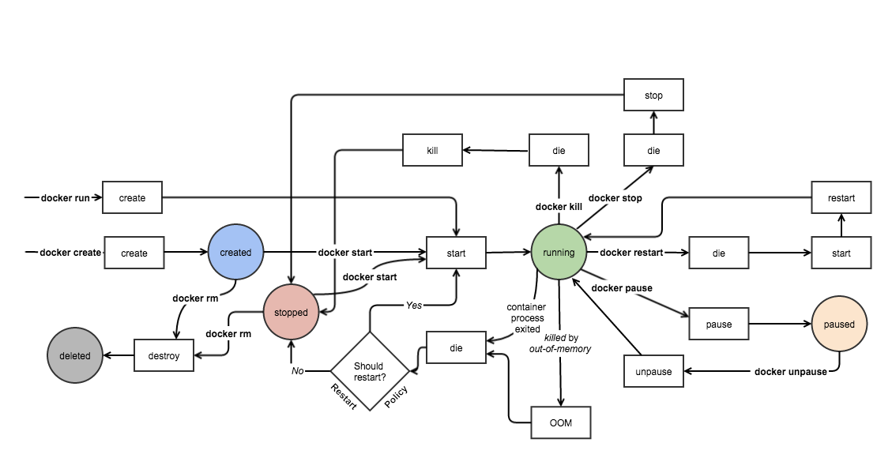

# docker


## 本仓库内容

1. docker学习笔记

```
Something I hope you know before go into the coding~
First, please watch or star this repo, I'll be more happy if you follow me.
Bug report, questions and discussion are welcome, you can post an issue or pull a request.
```

## 相关站点

* GitHub 地址 : <https://github.com/yifengyou/learn-docker>
* GibBook 地址 : <https://yifengyou.gitbooks.io/learn-docker/content/>
* GibPage 地址 : <https://yifengyou.github.io/learn-docker>

## 目录

* [docker简介](docs/docker简介.md)
    * [容器技术发展史](docs/docker简介/容器技术发展史.md)
    * [Namespace和CGroups](docs/docker简介/Namespace和CGroups.md)
    * [LXC和容器技术](docs/docker简介/LXC和容器技术.md)
* [docker容器技术基础](docs/docker容器技术基础.md)
    * [docker技术原理](docs/docker容器技术基础/docker技术原理.md)
    * [docker技术框架](docs/docker容器技术基础/docker技术框架.md)
* [docker安装](docs/docker安装.md)
    * [CentOS环境安装docker](docs/docker安装/CentOS环境安装docker.md)
    * [Ubuntu环境安装docker](docs/docker安装/Ubuntu环境安装docker.md)
* [docker教程](docs/docker教程.md)
    * [马哥带你3天玩转Docker容器实战](docs/docker教程/马哥带你3天玩转Docker容器实战.md)














 

---
