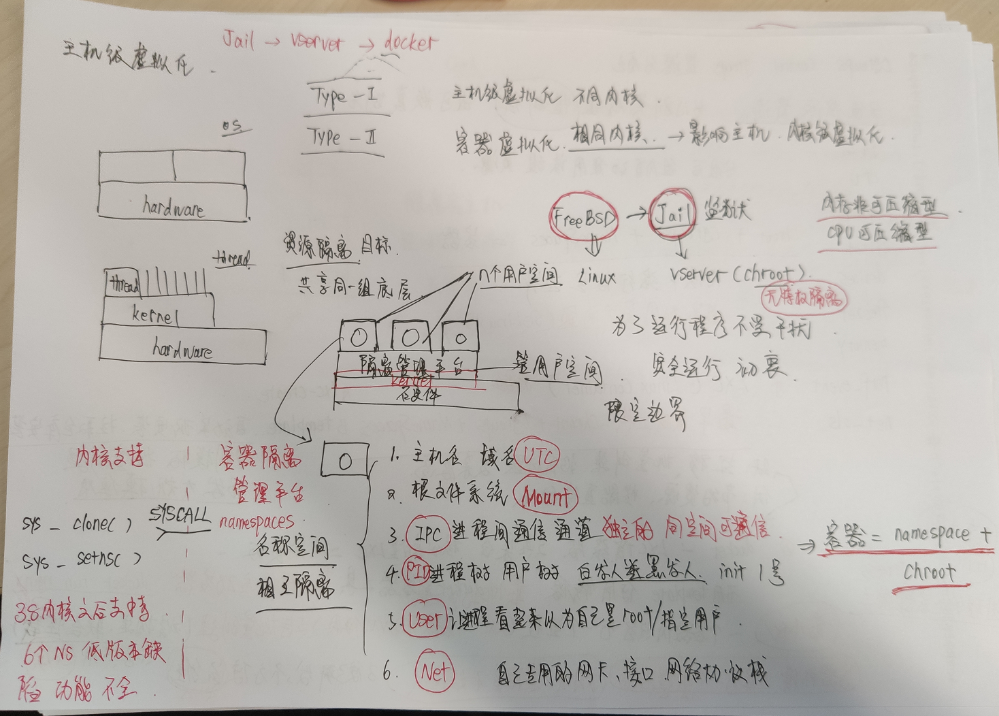
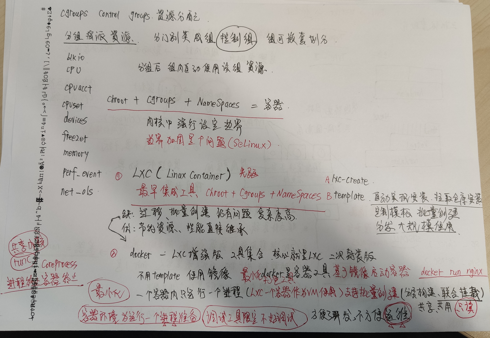
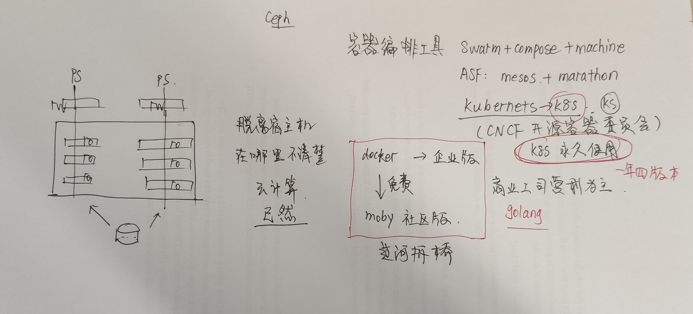

<!-- MDTOC maxdepth:6 firsth1:1 numbering:0 flatten:0 bullets:1 updateOnSave:1 -->

- [马哥带你3天玩转Docker容器实战](#马哥带你3天玩转docker容器实战)   
   - [课程优势](#课程优势)   
   - [课程大纲](#课程大纲)   
   - [讲师介绍](#讲师介绍)   
   - [我的笔记](#我的笔记)   
   - [相关笔记](#相关笔记)   

<!-- /MDTOC -->
# 马哥带你3天玩转Docker容器实战

Docker 是一个开源的应用容器引擎，让开发者可以打包他们的应用以及依赖包到一个可移植的容器中，然后发布到任何流行的 Linux 机器上，也可以实现虚拟化。容器是完全使用沙箱机制，相互之间不会有任何接口。Docker自2013年以来非常火热，无论是从 github 上的代码活跃度，还是Redhat在RHEL6.5中集成对Docker的支持, 就连 Google 的 Compute Engine 也支持 docker 在其之上运行。

它启动很快。启动一个Docker容器只需50毫秒。没有看错，是真的这么快。这就是使用高层级抽象的好处，这样减少了你所需运行的组件的数量。这也意味着，在它执行的过程中几乎没有额外的开销。

一键（单命令）部署。它是真的简单到安装一个应用只需输入一行命令。想要安装MySQL？一行命令。想到一下子把WordPress, MySQL, Nginx and Memcache全部安装并且配置完成？统统一行命令。

扩展性。这也是Docker很亮眼的特性之一，特别是，如果你的项目是基于微服务的。Compose and Swarm用来部署可扩展的应用系统，加上Kubernetes、Mesos等第三方应用，这两方面使服务器的扩展性提高到了更高的层级。可承载多达数百万级数量的容器的管理能力。

资源隔离。在过去，如果你想运行所有的服务在同一台服务器上，这可能会耗尽服务器的所有资源。Docker允许你基于各自应用或服务，进行设置、监听、调整。

Docker容器几乎可运行于任意的Linux平台，包括物理机、虚拟机、公有云、私有云、个人PC、服务器等。用户可以很方便地将应用程序在各平台间迁移。国内腾讯、百度、阿里、京东、小米、新浪、美团点评、滴滴等公司不断的加入，也随着Kubernetes技术也不断成熟，2019年将会有更大的应用和发展。掌握Docker、Kubernetes，是运维、开发、测试必不可少的高薪技能。


##  课程优势

本课程为市面上不可多得的全面Docker体系课程，其他同类线下Docker培训大多售价在2000-4000RMB，内容为2天10个课时左右。而本课程有14个课时专业内容，限时特价198，为其他培训价格十分之一，含金量为其他同类Docker课程2-3倍，并由国内Linux教父-马哥亲授。

1、课程内容讲解Docker版本为目前官方最新版18.06，并全面介绍其新特性，领先于市面上教程。

2、本课程会以企业实际应用为主线，对整个Docker架构进行全方面讲解。

3、本课程以理论+实战结合方式教学，让你知其然并知其所以然。

4、本课程为福利课程，原本定价800RMB，但近期新闻有说谷歌要回归，为迎接谷歌回馈开源，特此福利价198。


## 课程大纲

内容含金量为同类docker课程2-3倍不止，并由国内Linux教父-马哥亲授。
```
一、Linux容器技术基础

1、容器技术发展史

2、Namespace和CGroups

3、LXC和容器技术

二、Docker容器技术基础

1、Docker技术构架

2、安装部署Docker

3、Docker的镜像及容器的基础应用

三、Docker镜像

1、Docker镜像工作原理

2、基于容器制作Docker镜像

3、推送Docker镜像至Registry

4、镜像的本地分发

四、Docker网络

1、Docker网络模型及工作原理

2、Docker网络模型验正

3、暴露容器应用至节点外部

4、桥接式网络管理

5、配置Docker进程的网络属性

五、存储卷

1、存储卷类型及功能

2、存储卷应用

3、存储卷共享

六、Dockerfile

1、Dockerfile文件格式

2、各指令详解

3、案例：自定义entrypoint脚本，接收变量进行容器化应用配置

七、私有Registry

1、Registry的组织格式

2、利用docker-registry构建简单的私有Registry

3、docker-compose简介

4、使用VMWare Harbor构建企业级私有Registry

八、容器资源限制

1、资源限制模型

2、CPU资源限制及三种形式及其应用

3、内存及Swap资源限制及其应用

4、案例：使用stress-ng镜像验正资源限制效果
```


## 讲师介绍

马哥（马永亮）：马哥教育创始人CEO，51CTO金牌讲师和专家博主

计算机安全专业硕士，Linux核心专家、Linux运维教父、51CTO专家博主。多年Linux及数据库实战和教学经验，擅长讲授Linux运维、企业级运维自动化、系统架构和优化、hadoop海量数据、大并发架构设计、IaaS云技术等实战。马哥Linux、Python系列培训视频一直被网友们称为业内最专业的IT培训视频，马哥擅长把复杂抽象的大问题化解成具体形象的案例，其授课方式生动形象，幽默风趣。马哥在Linux界跟JAVA界马士兵称之为IT培训界的”马氏双雄”。在业内一直有着”马哥出品必是精品”之说。其教学方法及治学态度深受网友喜欢。直接或间接受教的真实学员数十万人，门徒遍布业内一二线互联网公司，往期学员已在腾讯、大众点评、巨人、盛大、九城、淘宝、滴滴、小米、京东、网易、平安、电信、一号店等知名公司担当要职！


## 我的笔记







* 镜像是静态的，不会运行。类似于程序
* 容器是动态的，有声明周期。类似于进程


## 相关笔记

* <https://blog.csdn.net/weixin_30549175/article/details/99901855>
